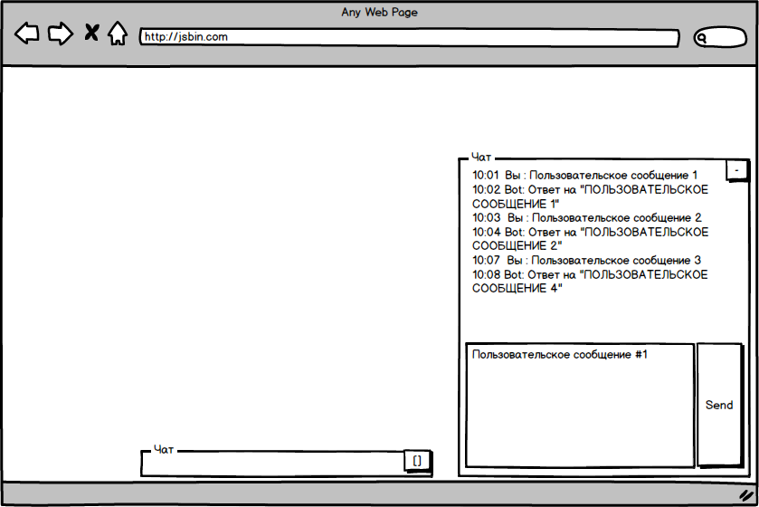
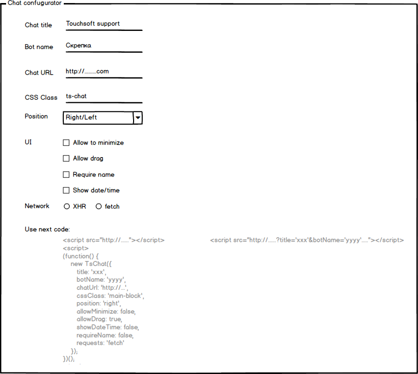
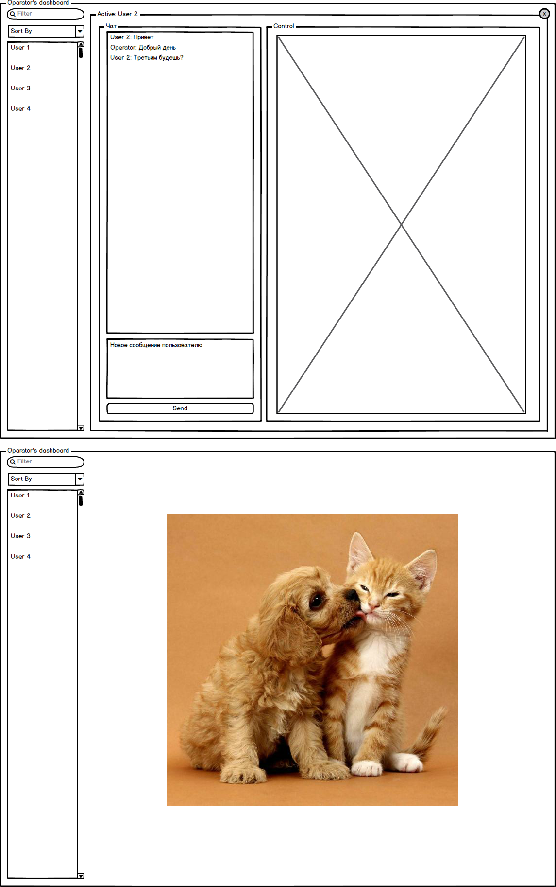
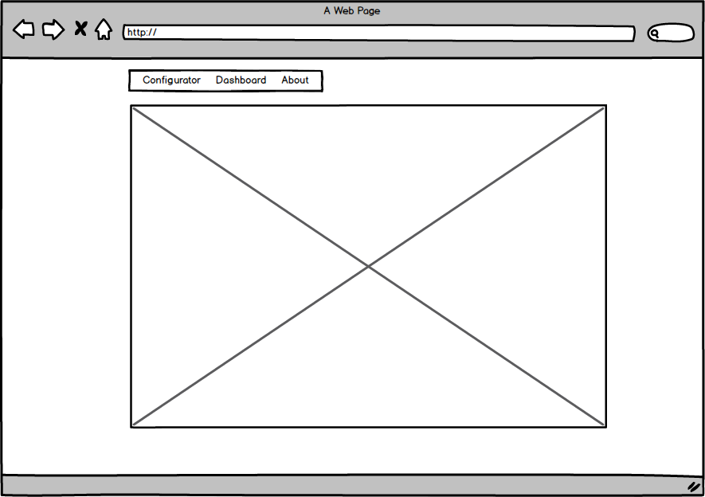
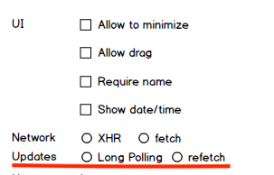
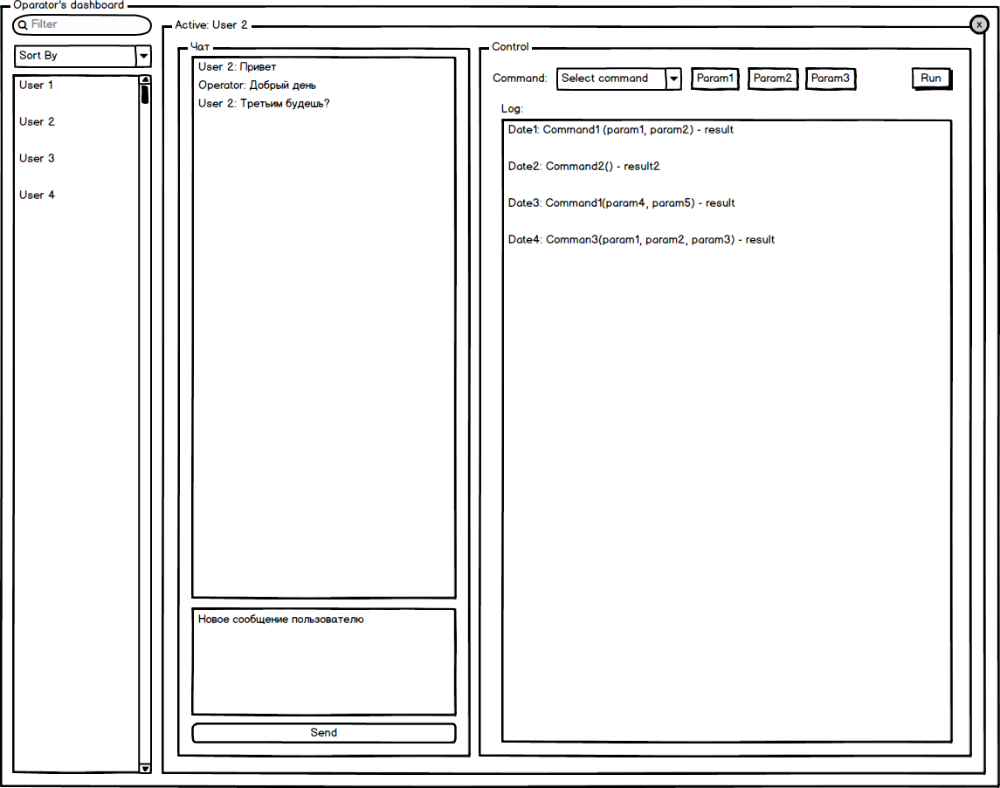

# Лабораторные работы по курсу JS компании TouchSoft


# Task 01 - Chat

- [X] Создать скрипт интерактивного чата. Чат должен быть предоставлен в виде одного скрипта, подключение которого на страницу (любую, просто включением тега скрипт с нужной ссылкой ) добавит на страницу окно чата.

```html
<!-- ... -->
<script src="https://path.for.your/script.file.js"></script>
<!-- ... -->
```



## Функционал

- [X] Окно должно показываться в нижнем правом углу, поверх основного содержимого страницы. У окна может быть два режима - свернуто и развернуто. При первом запуске окно свернуто, далее оно запоминает выбор пользователя и при обновлении страницы отображает окно в последнем активном состоянии.

- [X] Окно чата состоит из списка сообщений. Которое отображает время и историю сообщений. История сообщения сохраняется между обновлениями страницы. И формы отправки сообщения пользователем - многострочное поле ввода и кнопка отправки.

- [X] При нажатии на кнопку отправки - сообщение пользователя появляется в списке сразу. И через 15 секунд появляется ответ от бота в формате `Ответ на "{Сообщение пользователя в верхнем регистре}"`.

# Task 02 - Chat Configurator

- [X] Создать страницу для конфигурации скрипта чата.

Форма конфигурации позволяет настроить:

- [X] Заголовок окна чата
- [X] Имя бота
- [X] URL к API ([Firebase](https://firebase.google.com))
- [X] CSS класс, который будет навешен на главный блок чата
- [X] позицию чата (право/лево)
- [X] разрешать ли сворачивание чата
- [X] разрешать ли перетаскивание чата
- [X] требовать ли от посетителя ввод имени
- [X] показывать ли время в истории чата
- [X] способ выполнения запросов (fetch/XHR)
- [X] При изменении любой из опций внизу формы конфигурации обновляется блок, который выдает пример кода, для встраивания чата в соотвествии с настройками.



## Функционал чата

Расширяется следующим образом:

- [X] доступна опция требовать имя пользователя, до того, как появится возможность отправлять сообщения
- [X] возможно перетаскивание окна чата по экрану с помощью мыши ( перетаскивание за заголовок )
- [X] диалоги теперь должны сохраняться в базе (посредством REST API)

# Task 03 - Operators dashboard

- [X] Создать страницу для оператора чата.

Страница должна:

- [X] Отображать список пользователей чата (Имя, состояние пользователя, состояние чата, непрочитанные сообщения)
- [X] Позволять фильтровать пользователей по отображаемым полям, сортировать пользователей
- [X] Клик по пользователю в списке делает его активным и переключает состояние рабочей области
- [X] В рабочей области отображается история сообщений пользователя, и доступна возможность отправлять/получать сообщения от пользователя
- [X] Клик по иконке в правом верхнем углу активной области очищает выбор пользователя



# Task 05 - SPA

## Рефакторинг

- [ ] Разбить код на модули/файлы, которые будут обрабатываться системой сборки (убрать повторящийся код, учесть общий код для клиентского чата и дашборда)

## Одностраничное приложение

- [ ] Перевести сервисную часть на одностраничное приложение (с использованием hash-api). Приложение должно быть представлено тремя страницами (роутами):

- [ ] Конфигуратор чата
- [ ] Дашборд
- [ ] О проекте



- [ ] В верхней части страницы должно быть меню, реализующее навигацию между страницами. При переходе между страницами - должен изменяться URL. При обновлении страницы должно подтягиваться состояние приложения, соответствующее URL.

# Task 06 - Long polling

- [ ] Добавить в конфигуратор опцию, которая будет задавать, какой механизм использовать для получения новых сообщений.



- [ ] `refetch` - использовать периодические запросы на сервер с выбранной выше технологией (fetch/XHR)

- [ ] `long polling` - использовать одно подключение для подписки на изменения в БД

- [ ] Для интерфейса оператора всегда использовать `long polling`.

- [ ] Для этого нужно выделить модуль загрузки сообщений, определить для него интерфейс и сделать две реализации на соотвествующих технологиях.


# Task 07 - Commands




- [ ] В интерфейсе оператора, при выборе пользователя, появляется новый блок, для выполнения команд.

- [ ] Блок содержит форму выбора команды, ввод параметров для команды (до 2х) при необходимости и кнопку запуска задачи.

- [ ] Ниже находится блок с отображением лога выполненных команд, который отображает выполненные (или запущенные) команды и их результат, после выполнения.

- [ ] Необходимо реализовать минимум две команды (все команды асинхронные):

- [ ] получение информации о пользователе с помощью одно из сервисов (тип сервиса - параметр команды). Результат - данные от сервиса, загруженные на стороне клиента.

  - https://ipinfo.io/
  - http://ip-api.com/
  - https://geoip-db.com/

- [ ] запрос у пользователя информации через модальное окно (не `prompt`) - параметрами команды являются заголовок окна, текст сообщения, значение `placeholder` для поля ввода. Результат - текст, введенный пользователем.

## Замечания

- [ ] Команды не должны отображаться у пользователя в чате
- [ ] Команды должны выполнятся только один раз (не должно быть повторного выполнения команд при обновлении клиентом страницы)
- [ ] история команд должна храниться и быть доступной для оператора


# Task 08 - Рефакторинг и документирование кода

## Рефакторинг

- [ ] Если у вас в коде остались какие-то косяки и недоделки - время их исправлять. Нужно привести код в порядок, разбить на файлы и т.п.

## Документирование кода

- [ ] Все функции и классы нужно покрыть документацией с помощью jsdoc[1](https://ru.wikipedia.org/wiki/JSDoc)[2](http://usejsdoc.org/) комментариев. Далее нужно настроить систему сборки на генерацию html документации на основе комментариев. Можно использовать сам jsdoc или [esdoc](https://esdoc.org/).
